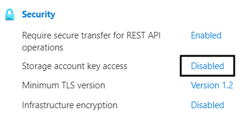
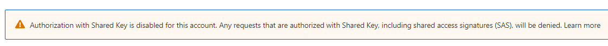

### Initial Setup
Create a Service Principal at the subscription level with Contributor rights
```
az ad sp create-for-rbac --role="Contributor" --scopes="/subscriptions/SUBSCRIPTION ID" --name "tfstate-spn"
```
Copy/paste the output into notepad for use later
```
{
  "appId": "00000000-0000-0000-0000-000000000000",
  "displayName": "tfstate-spn",
  "name": "00000000-0000-0000-0000-000000000000",
  "password": "#########################",
  "tenant": "00000000-0000-0000-0000-000000000000"
}
```
To apply more roles later you will need the object id of the Service Principal which we can get with this command:-
```
az ad sp list --display-name "tfstate-spn" --query "[].{displayName:displayName, objectId:objectId}" --output tsv
```
Note the object id from the output above.

To allow our Service Principal to access our terraform state container we need to give it another role scoped at the subscription level. The only role I needed to add was the **Storage Blob Data Contributor**, although I have seen other users suggest that you needed to add **Storage Blob Data Owner** too. We can do this like so:-


```
az role assignment create --assignee <objectId from above command>  --role "Storage Blob Data Contributor" --scope "/subscriptions/SUBSCRIPTION ID"
```
Before we can run our terraform code, we need to create some environment variables from out initial output
```
export ARM_CLIENT_ID="00000000-0000-0000-0000-000000000000"
export ARM_CLIENT_SECRET="#########################"
export ARM_SUBSCRIPTION_ID="00000000-0000-0000-0000-000000000000"
export ARM_TENANT_ID="00000000-0000-0000-0000-000000000000"
```
The ARM_CLIENT_ID is the appId from the output of the az ad sp create-for-rbac
The ARM_CLIENT_SECRET is the password from the output of the az ad sp create-for-rbac
The ARM_SUBSCRIPTION_ID is the id of the subscription you are deploying into
The ARM_TENANT_ID is the tenant from the output of the az ad sp create-for-rbac

Next we can test the service principal using the output from the **az ad sp create-for-rbac** command we saved earlier

```
az login --service-principal --username $ARM_CLIENT_ID --password $ARM_CLIENT_SECRET --tenant $ARM_TENANT_ID
```
### Terraform State File
We are now ready to run our terraform code to create the terraform state file in Azure using our Service principal.
The whole purpose of this POC is to create an Azure storage account for the terraform state with the SAS key disabled.
We need to add a property to our **azurerm_storage_account** block like this:-
```
shared_access_key_enabled = false
```
This property indicates whether the storage account permits requests to be authorized with the account access key via Shared Key. If false, then all requests, including shared access signatures, must be authorized with Azure Active Directory (Azure AD). The default value is true.

**Note:**
Terraform uses Shared Key Authorisation to provision Storage Containers, Blobs and other items - when Shared Key Access is disabled, you will need to enable the storage_use_azuread flag in the Provider block to use Azure AD for authentication, however not all Azure Storage services support Active Directory authentication.
Our provider block will now look something like this:-
```
provider "azurerm" {
  features {}
  storage_use_azuread = true
}
```
We can then run our terraform command from within our **state** folder (if you are using my sample repo).

```
terraform init
terraform apply --auto-approve
```

If these commands are successsful your storage account should have been created. Go into the Azure portal and locate the storage account. From the overview view under the Security section you should see that Storage account key access is disabled.




Then select the container and then from the blade on the left select Shared access tokens, you should get the following message:-



If everything is as expected we can move on to provisioning some Azure resources using terraform and our newly created terraform state file

### Provision Resources
Open the resources folder and ensure that you configure the backend block to use the storage account and resource group that you created in the previous steps. Mine looks like this:-
```
terraform {
  backend "azurerm" {
        use_azuread_auth     = true
# only hard coding these for demo purposes
##################################################################        
        resource_group_name = "tfstate-rg"
        storage_account_name = "tfstateresourcestor"
###################################################################
        container_name = "terraform-state"
        key = "tfstate"
    }  
```
Once this is done you can start my issuing the **terraform init** command

```
terraform init
```
If the permissions aren't set correctly this is the step that will generate the errors relating to permissions. The common error is:-

```
Error: autorest/azure: Service returned an error. Status=403 Code="AuthorizationPermissionMismatch" Message="This request is not authorized to perform this operation using this permission.
```
If you get the above error or any other error relating to permissions then you may need to add some further roles to the Service Principal.
If the terraform init command succeeds then the apply and any subsequent updates should work OK too.


